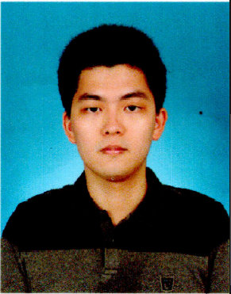

## <link rel="stylesheet" type="text/css" media="all" href="./css/logo.css"/> <i class = "fa fa-handshake-p" aria-hidden="true">About Speaker</i> 

**Name :**  Siravit Kwankajornkeat

**Affiliation :**  Wireless Network and Future Internet Research Unit Department of Electrical Engineering, Faculty of Engineering Chulalongkorn University

**Contact :**  sira_wisw@hotmail.com

    
Click Here for Short Biography!

    ....(Optional)....

-----------

**Name :**  Kittipat Saengkaenpetch

**Affiliation :**  Engineer (Level-6) Database Administration Section  
                      Electricity Generating Authority of Thailand (EGAT), Thailand 
                      Wireless Network and Future Internet Research Unit 
                      Department of Electrical Engineering, Faculty of Engineering Chulalongkorn University

**Contact :**  kittipat.sae@gmail.com

## <link rel="stylesheet" type="text/css" media="all" href="./css/logo.css"/> <i class = "fa fa-handshake-p" aria-hidden="true">Presentation Topic:</i>
<h3> Cloud-Based Smart Energy Framework for Accelerated Data Analytics with Parallel Computing of Orchestrated Containers: Study Case of CU-BEMS </h3>

## <link rel="stylesheet" type="text/css" media="all" href="./css/logo.css"/> <i class = "fa fa-handshake-p" aria-hidden="true">Presentation Material:</i>
- [fetch.html](presentation_material/fetch_.html)
- [Slide - Presentation](presentation_material/Smart Energy.pdf)

<h3><a href="/Presentation_program/13_Cloud_Based_Smart_Energy/presentation_material">>>Click Here to Download Materials<<</a></h3>